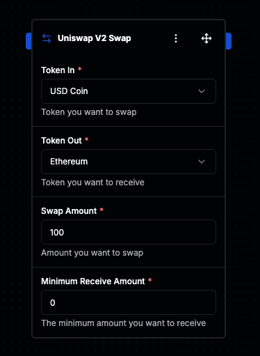
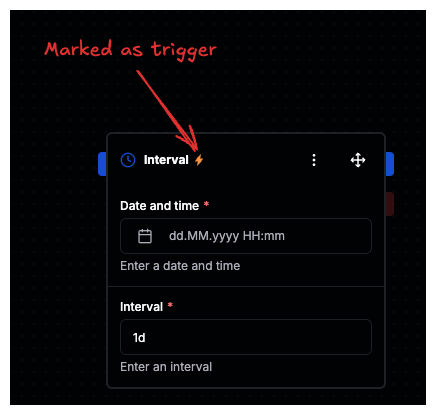
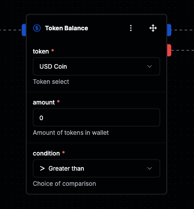
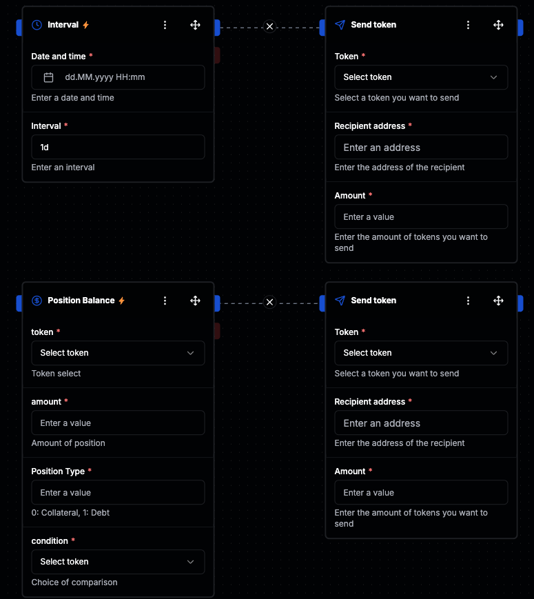
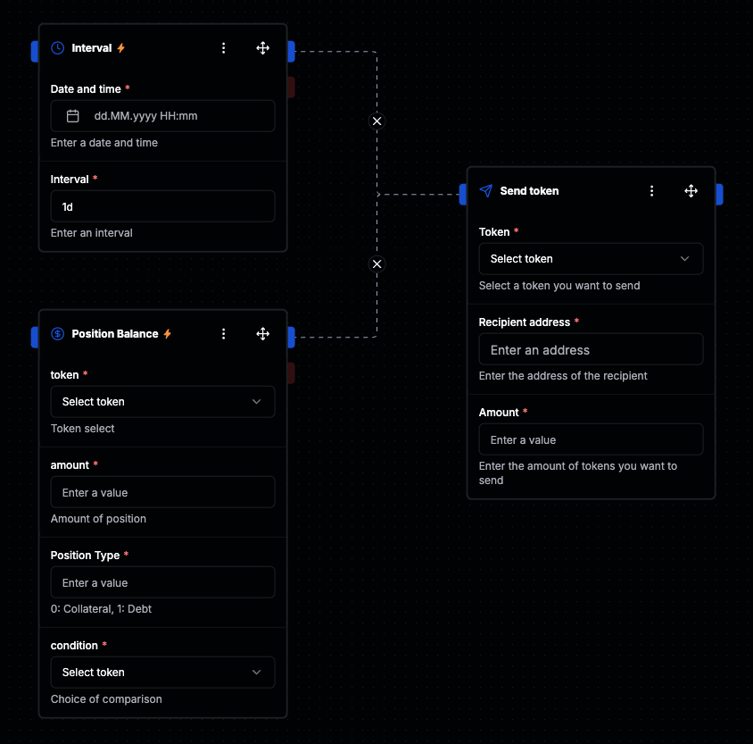

# Strategy Builder Guide

## Creating Strategies with Drag & Drop

Strategies can be created using the drag and drop editor within the app.

When selecting elements to use in your strategy, you can distinguish between _Actions_ and _Conditions_.

- A _Condition_ checks whether a specific requirement is met.
- An _Action_ can trigger one or multiple operations that are executed on the blockchain in the background.

To build your strategy, simply drag the desired elements into the editor and configure them according to your needs.

## Actions

Actions are mostly used to interact with other protocols on the blockchain.  
A typical example is performing a token swap on a DEX like Uniswap V2, as shown in the image below.

Within the Action element, you can configure the required parameters for the specific action.  
An Action can execute one or multiple operations in the background.

In the case of a Swap on UniswapV2, two operations are typically required:

1. Approving the tokens that should be swapped.
2. Executing the swap on UniswapV2.

---

## Conditions

Conditions are a fundamental part of building your strategy.

On the one hand, they are used to define the _trigger_ that will execute a part of your strategy.

On the other hand, Conditions can be used to build _true_ or _false_ paths within your strategy and make decisions based on specific parameters.

> Important:  
> In order to activate and run a strategy, you always need at least one Condition element in the editor.  
> This defines under which conditions the strategy is allowed to execute.

A trigger Condition is also referred to as an _entrypoint_.  
You can use multiple triggers (entrypoints) within a single strategy.

The trigger (entrypoint) is visually marked with a special symbol, as shown in the image below.

If a Condition does not represent a trigger (entrypoint), the element will automatically have two outputs:

- A red output
- A blue output

The behavior is as follows:

- The red output is always used if the Condition evaluates to _false_.
- The blue output is always used if the Condition evaluates to _true_.

> Note:  
> It is not mandatory to connect both outputs.  
> You can decide to only use the true-path (blue) or false-path (red), depending on your strategy design.

## Strategy Setup Options

There are multiple ways to set up a strategy within the Strategy Builder.

It is possible to use several triggers (_entrypoints_) within a single strategy.  
For example:

- You can define two different triggers that execute different actions.
- Alternatively, you can have multiple triggers that lead to the same actions or execute the same part of your strategy.

This provides maximum flexibility when designing complex strategies.

### Example 1: Multiple Triggers → Different Actions

  
_Each trigger leads to different actions._

---

### Example 2: Multiple Triggers → Same Actions

  
_Multiple triggers lead to the same part of the strategy._
