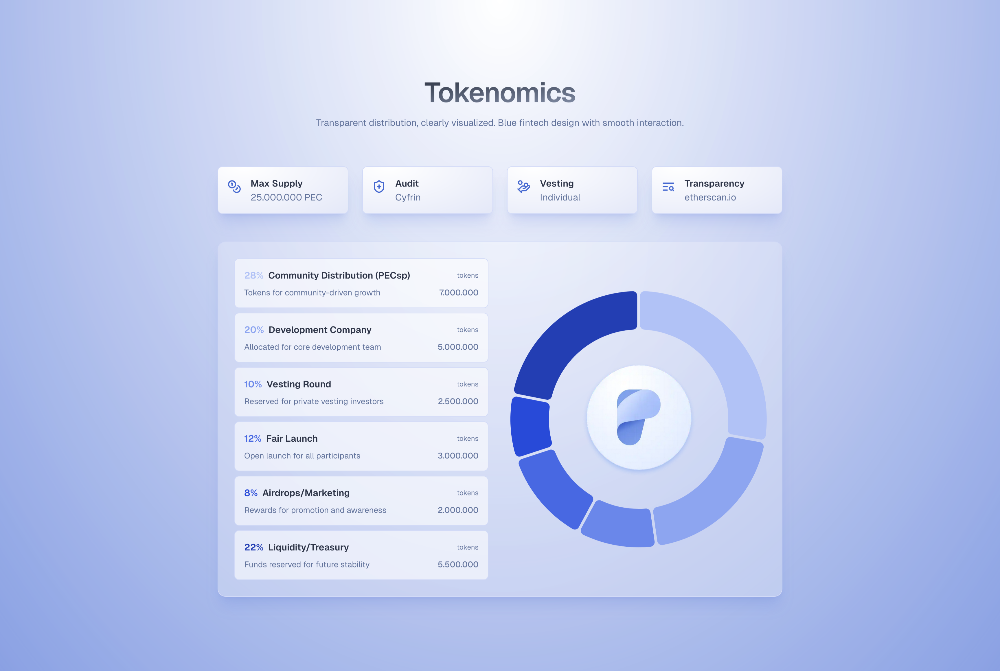

# $PEC Tokenomics

## Token

- **Name:** Pecunity Token
- **Short Name:** $PEC
- **Blockchain:** BNB
- **Jurisdiction:** Germany
- **Classification:** Utility Token
- **Total Token Supply:** 25,000,000
- **Inflation:** No
- **Private Sales:** No
- **TGE Price:** ~ $0.14
- **Fully Diluted Valuation on TGE:** ~ $3.5M

---

## Distribution Details

### Community Distribution (PECsp)

For community members that hold PECsp tokens because of previous support.

- **Share of total:** 28%
- **TGE Unlock:** 0%
- **Cliff:** 1 month
- **Vesting:** 48 months
- **Interval:** Linearly every second/block

---

### Dev Company

Company tokens for development, marketing, listing fees, audits, research, legal opinion, etc.

- **Share of total:** 20%
- **TGE Unlock:** 0%
- **Cliff:** 3 months
- **Vesting:** 36 months
- **Interval:** Linearly every second/block

---

### Vesting Round

Tokens sold before TGE in additional special rounds to community on Launchpads. No private round.

- **Share of total:** 10%
- **TGE Unlock:** 25%
- **Cliff:** 0
- **Vesting:** 9 months
- **Interval:** Linearly every second/block

---

### Fair Launch (Pinksale)

Tokens sold to community before TGE on Pinksale at the beginning of October.

- **Share of total:** 12%
- **TGE Unlock:** 100%
- **Cliff:** 0
- **Vesting:** 0
- **Interval:** Linearly every second/block

---

### Airdrops / Marketing

Will be airdropped to reward supporters that help grow the project.

- **Share of total:** 8%
- **TGE Unlock:** 10%
- **Cliff:** 0
- **Vesting:** 18 months
- **Interval:** Linearly every second/block

---

### Liquidity / Treasury

Will not be distributed to any party. Is used for liquidity and long term treasury.

- **Share of total:** 22%
- **TGE Unlock:** 40%
- **Cliff:** 0
- **Vesting:** 12 months
- **Interval:** Linearly every second/block
