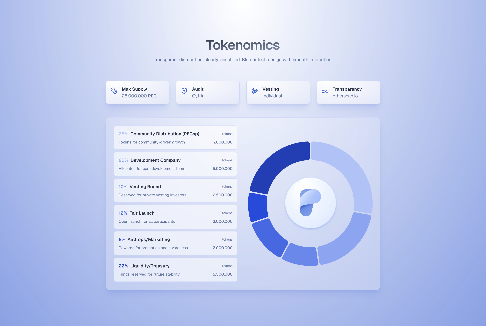

# $PEC Token Whitepaper

This document outlines the tokenomics of $PEC ($PEC), the Utility Token designed to support the growth and utility of the Pecunity Protocol.  
The Pecunity Protocol is an Open Source Smart Contract Infrastructure to help users gain yield with automated DeFi strategies.  
The Pecunity App is a frontend webpage for the Pecunity Protocol.

---

## About

$PEC ($PEC) is a utility token issued by **3Blocks UG (haftungsbeschränkt)**, hereinafter referred to as **"3Blocks"**, in behalf of the open source Pecunity Protocol ecosystem.  
3Blocks acts strictly as an issuer of the token and has no legal control or responsibility over the open source community-driven Pecunity Protocol or its Strategies.

The tokenomics of $PEC are designed to help Pecunity Protocol and the whole DeFi space to grow. It has measures in place to enhance stability and reward community involvement. Through the use of $PEC, participants interact directly with the Pecunity Protocol in a decentralized framework.

The issuance of $PEC follows fair and transparent principles.  
3Blocks is a German software company that creates the $PEC token in compliance with German law and is responsible for Smart Contract Development, Launchpad Listing, CEX/DEX Listing and Market Maker commissioning.

3Blocks provides ongoing technical contributions and infrastructure support to the Pecunity Protocol. Its control over the protocol is intentionally limited. The long-term goal is to establish a fully decentralized governance system.

> For more information on 3Blocks, please visit [3blocks.net](https://3blocks.net).

---

## Utility Token

$PEC is issued as a Utility Token.  
The token functions as a voucher for Strategy Executions, Gas Fee Payment, fee reduction through locking, and community rewards.  
$PEC is **not designed for financial investment**, and holders do **not gain any stake**, dividends, profits, or voting rights.

---

## Token Design

Our token is designed for simplicity, fairness, and long-term value:

- **Real Utility:** $PEC is used on every transaction inside the Pecunity Protocol, either as the main token or for burn.
- **Deflationary by design:** A portion of every fee is permanently burned, reducing total supply over time and helping increase scarcity and potentially value over the long run. The maximum supply is fixed.
- **No traditional staking:** To keep inflation low, there is no token staking. This keeps the system user-focused and resistant to speculative dumping.
- **No private sales:** We do not give early access to VCs, influencers, or private investors. Everyone participates on equal footing, reducing early sell pressure and ensuring a level playing field.
- **Vesting and cliffs:** Our cliffs and vestings reduce sell pressure.

---

## Token Parameters

| Parameter              | Value                                              |
| ---------------------- | -------------------------------------------------- |
| **Name**               | Pecunity Token                                     |
| **Short Name**         | $PEC                                               |
| **Blockchain**         | BSC                                                |
| **Jurisdiction**       | Germany                                            |
| **Classification**     | Utility Token                                      |
| **Total Token Supply** | 25 Mio.                                            |
| **Inflation**          | No                                                 |
| **TGE Price**          | Depends on Pinksale Fair Launch: target ~0.14 cent |
| **FDV on TGE**         | Depends on Pinksale Fair Launch: target ~3.5 Mio   |

---

## Distribution Details

### Community Distribution – PECsp (28%)

Allocated to community members while they have PECsp locked. Distribution occurs over 48 months continuously blockwise with a 1-month cliff.

### Development Company (20%)

Reserved for the development company serving as the main contributor to the project.  
Includes a 3-month cliff and linear monthly vesting over 36 months.

### Vesting Round (10%)

Sold in special community rounds.  
No private or VC rounds. No cliff, 25% unlocked at TGE, remaining 75% vested linearly monthly over 6 months.

### Fair Launch (12%)

Tokens sold to the community via the Pinksale Fair Launch prior to TGE.  
No cliff, no vesting: 100% unlocked at TGE.  
No VC or private sales; community first.

### Marketing (6%)

Dedicated to rewarding supporters and promoting ecosystem growth.  
10% unlocked at TGE, remaining 90% vested linearly monthly over 18 months.

### Community Incentives (2%)

Used to reward active community participants (see “Activity Rewards”).  
25% unlocked at TGE, remaining 75% vested linearly monthly over 6 months.

### Liquidity & Treasury (22%)

Allocated for liquidity provision and long-term treasury management.  
40% unlocked at TGE, remaining 60% vested linearly monthly over 12 months.

---

## Locking Mechanism

Community members can lock their tokens for additional rewards, making participation even more worthwhile.  
Locking provides benefits like reduced fees, increased activity rewards, exclusive NFTs, special support, and more.

### Locking Levels

| Level       | Required $PEC | Benefits                                                                   |
| ----------- | ------------- | -------------------------------------------------------------------------- |
| **Basic**   | 500           | 5% fee reduction                                                           |
| **Bronze**  | 2,500         | Activity Reward Multiplier: 2 7.5% fee reduction                        |
| **Silver**  | 5,000         | Activity Reward Multiplier: 3 10% fee reduction                         |
| **Gold**    | 30,000        | Activity Reward Multiplier: 4 Pecunity Club Access 15% fee reduction |
| **Diamond** | 125,000       | Activity Reward Multiplier: 5 Pecunity Club Access 25% fee reduction |

Each level comes with its own unique benefits, encouraging members to grow alongside the community.

> When you lock your tokens, you will get the benefits directly, but they become non-transferable for a minimum of 120 days after you added your last tokens.  
> NFT holders should note that the fee reductions from locking and NFT ownership are **not cumulative**. The greater of the two benefits will apply.

---

## Activity Rewards

Our **Activity Rewards** operate within a Promotional Contest structure.  
Users earn activity points through platform engagement such as user-generated content (UGC), transactions, referrals, quizzes, and other interactive actions.  
These actions fall into promotion categories like UGC contests, referral programs, and social-media giveaways.

Depending on your Activity Points, you will receive rewards from the “Community Incentives” allocation within the Tokenomics over different time periods.  
A leaderboard will track your progress and rank you based on your contributions.  
Rewards can also be Stablecoins or benefits like free transactions.

> See **Activity Rewards Terms Of Use** for more information.

---

### Referral Users

You can invite new users to join Pecunity by sharing your unique referral link.  
When users sign up through your link, you will get Activity Points depending on the fees accrued by the new user.

| Level       | Referred User Fees | Reward                      |
| ----------- | ------------------ | --------------------------- |
| **Basic**   | $5                 | Activity Points Airdrop     |
| **Bronze**  | $15                | 2× Activity Points Airdrop  |
| **Silver**  | $45                | 3× Activity Points Airdrop  |
| **Gold**    | $200               | 5× Activity Points Airdrop  |
| **Diamond** | $800               | 10× Activity Points Airdrop |

---

## Marketing

The development company is responsible for managing and distributing the tokens allocated to the “Marketing” category.  
These tokens may be used to reward contributors who actively help grow the project.  
The distribution will be carried out at the company’s own discretion, ensuring that marketing incentives are aligned with the long-term goals and sustainability of the project.

---

## Community Distribution

The core of the community, who supported in previous projects, received **PECsp**.  
PECsp stands for **Pecunity Staking Pass**, and depending on the number of PECsp you hold, you get $PEC distributed.

---

## Token Utility

Unlike many tokens that are only used for staking, memes, or inflationary rewards, **$PEC** is directly built into the Pecunity Protocol to create **real value through deflation** based on platform usage.  
The more the platform is used, the more $PEC is burned.

This motivates both the company and the community to improve Pecunity, increasing deflation and reducing sell pressure over time.

---

### Protocol Fee

When Pecunity Protocol Strategies are executed by Automation Servers, a fee is charged and can be paid in either $PEC or other tokens.  
If you pay with $PEC you get a **25% discount**.  
If you pay with any other token, you won’t receive the discount and a larger absolute amount of $PEC will be burned.

**Fee distribution:**

1. Burn: 40%
2. Strategy Creator: 10%
3. Automation Server: 30%
4. Development Company: 20%

> You can download the Whitepaper as a PDF version [here](https://drive.google.com/file/d/1_PwrxNyYpo_8OOT9v_CCj6pjfOOnKqIz/view?usp=sharing).
