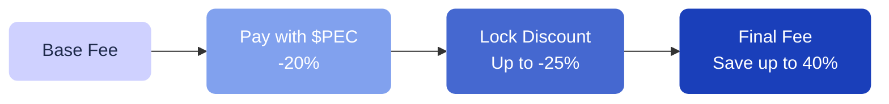

# Fee Discounts

There are two ways to reduce your fees on Pecunity: **paying with $PEC** and **locking $PEC**.

---

## 1. Pay with $PEC

When you pay strategy fees using $PEC tokens instead of other tokens, you receive an automatic **20% discount** on the total fee.

This discount applies to every fee-bearing action in your strategies.

---

## 2. Lock $PEC for additional discounts

By locking $PEC tokens, you unlock additional fee reductions on top of the $PEC payment discount:

| Lock level | $PEC required | Additional fee reduction |
| --- | --- | --- |
| **Basic** | 500 | 5% |
| **Bronze** | 2,500 | 7.5% |
| **Silver** | 5,000 | 10% |
| **Gold** | 30,000 | 15% |
| **Diamond** | 125,000 | 25% |

[!ref How to lock $PEC](/pec-token/locking/)

---

## Combined savings example

Here's what a $10.00 action fee looks like at different discount levels:

| Setup | Calculation | You pay |
| --- | --- | --- |
| No $PEC, no lock | $10.00 | **$10.00** |
| Pay with $PEC | $10.00 × 0.80 | **$8.00** |
| $PEC + Basic lock | $8.00 × 0.95 | **$7.60** |
| $PEC + Silver lock | $8.00 × 0.90 | **$7.20** |
| $PEC + Gold lock | $8.00 × 0.85 | **$6.80** |
| $PEC + Diamond lock | $8.00 × 0.75 | **$6.00** |

At the Diamond level, you save **40%** on every fee.

---

## NFT fee reductions

Some Pecunity NFTs also provide fee reductions. However, NFT and locking discounts are **not cumulative** — only the higher discount applies.

---

## Key takeaways

- Paying with $PEC is always cheaper than paying with other tokens
- Locking $PEC gives you progressively larger discounts
- No one is forced to buy $PEC — it is an optional benefit
- Higher lock levels also boost your [loyalty points](/rewards/loyalty/) multiplier
