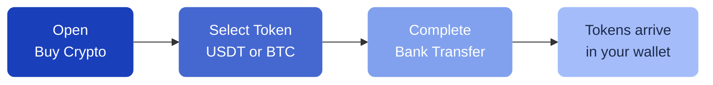

# Buy Crypto

You can buy crypto directly within Pecunity using a bank transfer. This feature is powered by **DFX**, a regulated Swiss on-ramp service.

---

## How it works

1. Open **Buy Crypto** from the sidebar menu
2. Select the token you want to buy (USDT or BTC)
3. Follow the DFX widget instructions to complete your bank transfer
4. Once the payment is processed, the tokens appear in your Pecunity wallet

!!!
Your smart account wallet must be deployed before you can use the Buy Crypto feature. If it hasn't been deployed yet, Pecunity will guide you through this step automatically.
!!!

---

## Supported tokens

| Token | Network |
| --- | --- |
| USDT (Tether) | BNB Smart Chain |
| BTC (Bitcoin BEP-20) | BNB Smart Chain |

---

## Sell crypto

You can also sell your crypto back to fiat currency using the **Sell Crypto** feature in the sidebar. The same DFX service handles the off-ramp process.

---

## Alternative: Transfer from another wallet

If you prefer, you can send tokens directly from any external wallet to your Pecunity address. Your address is available in **Settings** or by clicking **Receive** in the Collectibles section.

Pecunity operates on the **BNB Smart Chain**. Make sure to send tokens on the correct network to avoid losing funds.
