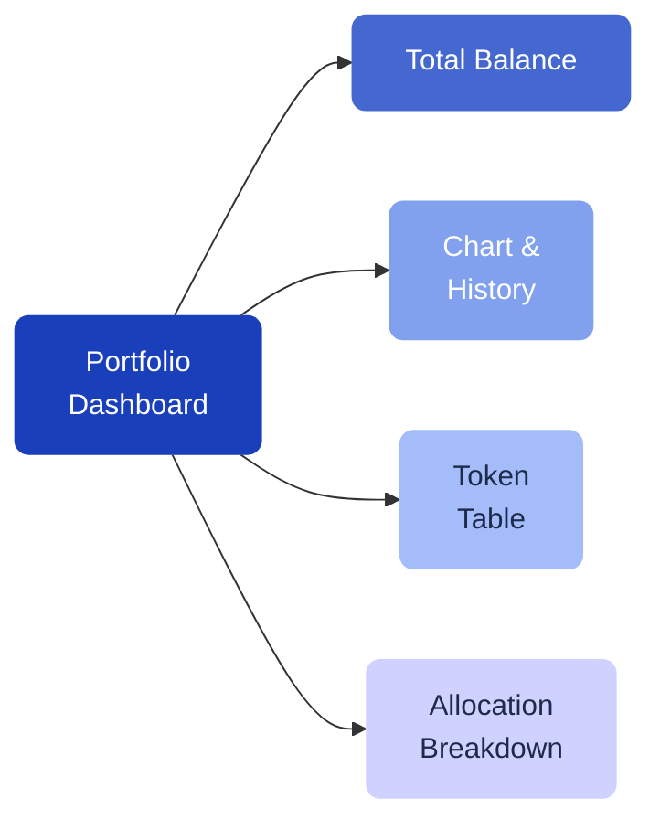

# Your First Steps

After creating your account, you land on the **Portfolio** dashboard. This is your home base in Pecunity, where you see everything at a glance.

---

## The Portfolio dashboard

Your dashboard shows:

- **Total balance** — the combined value of your wallet tokens, locked $PEC, and active strategies
- **Portfolio chart** — how your balance has changed over time (1 day, 7 days, 14 days, 30 days, or 90 days)
- **Allocation breakdown** — how your assets are distributed across wallet, strategies, and locked tokens
- **Token table** — a detailed list of all tokens you hold, with prices and balances

If your portfolio is empty, you'll see a getting-started guide that walks you through the next steps.

---

## Fund your account

To start using Pecunity, you need to deposit tokens into your smart account. You have several options:

### Buy crypto with fiat

Use the **Buy Crypto** feature to purchase USDT or BTC directly with bank transfer or card. Pecunity uses the DFX on-ramp service to process your purchase.

[!ref Buy Crypto](/getting-started/buy-crypto/)

### Transfer from another wallet

If you already hold crypto in another wallet (MetaMask, Trust Wallet, etc.), you can send tokens directly to your Pecunity smart account address. Find your address in the **Settings** or by using the **Receive** function.

### Use WalletConnect

Connect your existing Web3 wallet via **WalletConnect** to interact with dApps while using your Pecunity smart account.

---

## Explore the app

Use the sidebar navigation to access all features:

| Section | What it does |
| --- | --- |
| **Portfolio** | Overview of all your assets and balances |
| **Strategies** | Browse, create, and manage DeFi strategies |
| **Collectibles** | View your NFTs and Community Chests |
| **PEC Token** | Check $PEC statistics, lock tokens, claim distributions |
| **Loyalty** | Track your loyalty points and leaderboard rank |
| **Referral** | Share your referral code and earn rewards |
| **Transfers** | View your full transaction history |

---

## Next steps

Ready to put your assets to work? Explore the strategy catalog to find a strategy that fits your goals.

[!ref Explore Strategies](/strategies/overview/)
