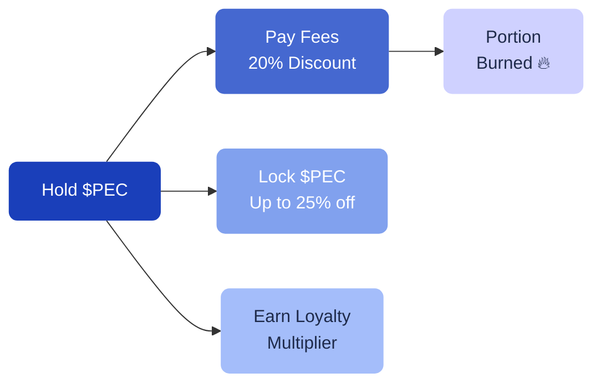

# What is $PEC?

**$PEC** (Pecunity Token) is the utility token that powers the Pecunity ecosystem. It is used for fee payments, unlocking benefits through locking, and earning community rewards.

---

## Why $PEC matters to you

| Benefit | How it helps |
| --- | --- |
| **Lower fees** | Pay strategy fees with $PEC and get a 20% discount |
| **Lock for more savings** | Lock $PEC to unlock up to 25% additional fee reduction |
| **Earn rewards** | Get loyalty point multipliers when you lock $PEC |
| **Deflationary** | A portion of every fee is burned, reducing supply over time |

---

## Token basics

| Parameter | Value |
| --- | --- |
| **Name** | Pecunity Token |
| **Symbol** | $PEC |
| **Blockchain** | BNB Smart Chain |
| **Total supply** | 25,000,000 (fixed, no inflation) |
| **Contract** | `0x413c2834f02003752d6Cc0Bcd1cE85Af04D62fBE` |

---

## How $PEC is used

### Fee payments

When a strategy executes, fees are charged. You can pay these fees in $PEC or in other tokens.

- **Pay with $PEC** → 20% fee discount + 40% of the fee is burned
- **Pay with other tokens** → no discount + 50% is burned as $PEC

Either way, $PEC gets burned with every transaction, making it deflationary.

[!ref Fee details](/fees/overview/)

### Locking

Lock your $PEC tokens to unlock tiered benefits: fee discounts, loyalty multipliers, and exclusive access.

[!ref Locking benefits](/pec-token/locking/)

### Activity rewards

Earn $PEC through platform engagement, referrals, and community activities.

[!ref Loyalty program](/rewards/loyalty/)

---

## PEC Statistics page

In the app, go to **PEC Token > Statistics** to see live data:

- Token price and market cap
- Circulating supply vs. max supply
- Total burned tokens
- Total locked supply
- Fully diluted valuation

---

## Claiming $PEC

If you hold **PECsp** (Pecunity Staking Pass) tokens from previous community support, you can claim your $PEC distributions under **PEC Token > Claim**. The distribution follows a 48-month vesting schedule with a 1-month cliff.
