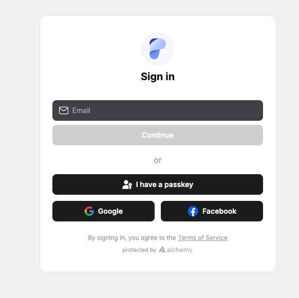

Pecunity makes it simple to create and manage your Web3 account.

## Sign in options

- **Social login**  
  Sign in with Google or Facebook in just a click.

- **Email login**  
  Use any email address to create and access your account.

- **Passkeys**  
  Create a passkey for quick and secure future logins without needing a password.

---

## How it works

Behind the scenes, every login (social, email, or passkey) creates a **smart contract account**.  
This smart account enables:

- **Sponsored transactions** → you don’t need to hold native coins to pay gas.
- **Batch transactions** → group multiple actions into one efficient transaction.

---

## Security features

- **Multi-factor authentication (MFA)** adds an extra layer of protection.
- **Account transfer** allows you to safely move your account to another owner whenever needed.

---

## Why it matters

:icon-shield: With Pecunity, you get the ease of Web2 logins combined with the power of Web3 smart accounts, without the usual complexity of wallets or gas fees.
