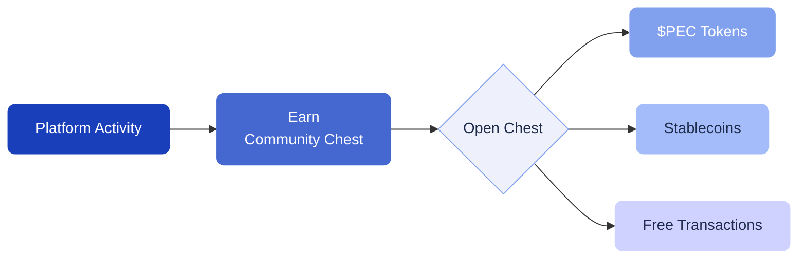

# Community Chests & Collectibles

Community Chests are reward NFTs that you can earn through platform activity. Every chest contains a guaranteed reward — there are no empty outcomes.

---

## How to earn Community Chests

You can receive Community Chests through:

- **Loyalty program rewards** — reaching point thresholds
- **Airdrops** — distributed by the team as marketing rewards
- **Special events** — promotional campaigns and contests

---

## What's inside a chest?

Each Community Chest contains one of the following:

- **$PEC tokens**
- **Stablecoins** (USDT)
- **Free transactions**
- **Other platform benefits**

The reward amount varies, but every chest is guaranteed to contain something valuable.

---

## Viewing your collectibles

Go to **Collectibles** in the sidebar to see all NFTs you own. This includes Community Chests and any other NFTs in your wallet.

You can:
- **View details** of each NFT, including its traits and properties
- **Claim rewards** from Community Chests by interacting with them
- **Receive NFTs** from other wallets using the **Receive** button

---

## PECsp (Staking Pass)

The **Pecunity Staking Pass (PECsp)** is a special NFT held by early community supporters. If you hold PECsp, you receive $PEC token distributions over time.

Claim your distributions under **PEC Token > Claim** in the app.

---

## Marketplace

The NFT marketplace has moved to the **Legacy** section of the app. If you want to trade NFTs, navigate to **Legacy > Marketplace**.
