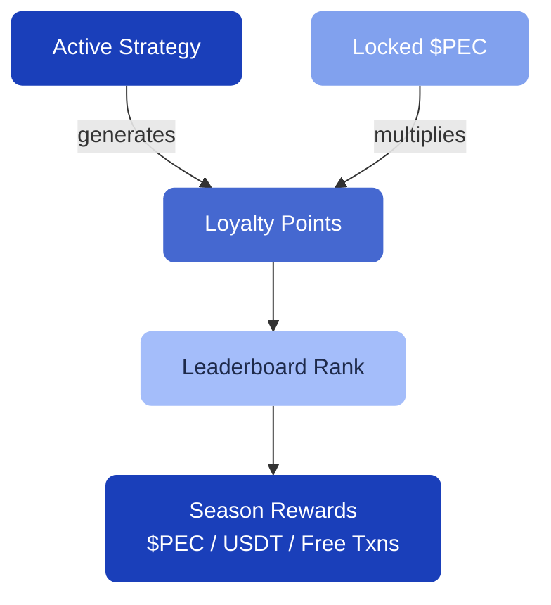

# Loyalty Program

The Pecunity Loyalty Program rewards you for actively using the platform. Earn loyalty points, climb the leaderboard, and receive rewards at the end of each season.

---

## How it works

Your loyalty points grow based on **the value of your active strategies**. The more you have invested in active strategies, the more points you earn over time.

### Boosting your points

You can multiply your point earnings by **locking $PEC tokens**:

| Lock level | Multiplier |
| --- | --- |
| No lock | 1x |
| Bronze (2,500 $PEC) | 1.5x |
| Silver (5,000 $PEC) | 2x |
| Gold (30,000 $PEC) | 2.5x |
| Diamond (125,000 $PEC) | 4x |

[!ref Lock your $PEC](/pec-token/locking/)

---

## Seasons

The loyalty program runs in **seasons** — defined time periods during which points accumulate. At the end of each season, top participants receive rewards.

You can see the current season's progress and your rank on the **Loyalty** page in the app.

---

## Leaderboard

The leaderboard ranks all participants by their loyalty points. Check your position and see how you compare to other users.

---

## What you can earn

Loyalty rewards can include:

- **$PEC tokens**
- **Stablecoins** (USDT)
- **Free transactions**
- **Community Chests** with random rewards

---

## Getting started

To earn loyalty points, you need:

1. :icon-check-circle: **An active strategy** — at least one strategy must be running
2. :icon-check-circle: **Optional: Locked $PEC** — to multiply your earnings

Go to **Loyalty** in the sidebar to see your current points and leaderboard position.
