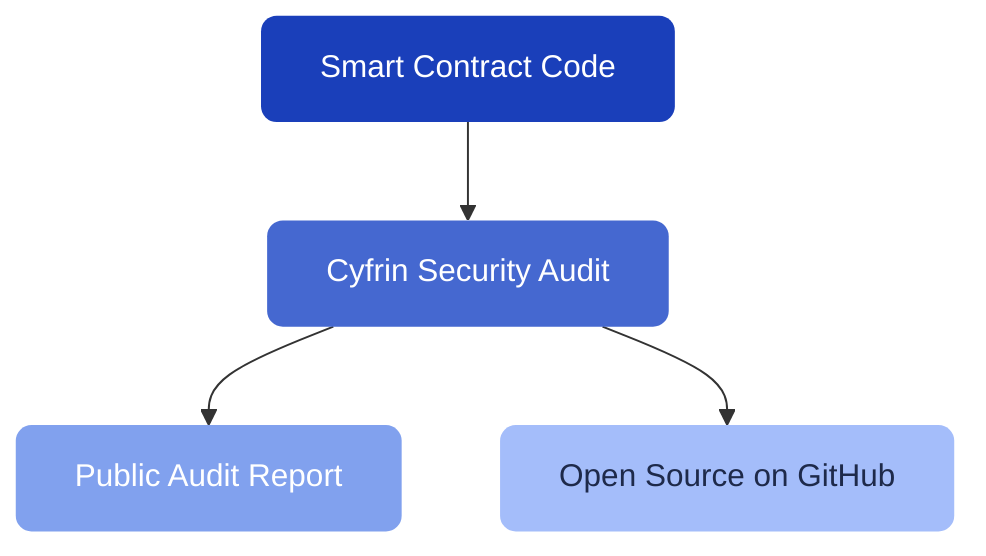

# Security Audits

The security of the Pecunity protocol is a top priority. The core smart contracts have been professionally audited to ensure the safety of user funds.

---

## Cyfrin Audit

The **Strategy Builder** smart contracts have been audited by **Cyfrin**, a leading blockchain security company known for their rigorous smart contract reviews.

Cyfrin specializes in DeFi protocol security and has audited many well-known projects in the ecosystem.

---

## Audit Report

The complete audit report is publicly available:

[!ref target="blank" text="Cyfrin Audit Report — Pecunity v2.0 (PDF)"](https://github.com/Cyfrin/cyfrin-audit-reports/blob/main/reports/2025-07-17-cyfrin-pecunity-v2.0.pdf)

---

## What was audited

The audit covered the core strategy execution infrastructure:

- **StrategyBuilderModule** — the smart contract that constructs and executes strategy user operations
- **Strategy Vaults** — the isolated contracts that hold strategy funds
- **Fee handling** — the contracts that manage fee collection, distribution, and burning
- **Modular Account** — the smart account implementation

---

## Open source

The Pecunity smart contracts and protocol are open source. You can review the code yourself:

[!ref target="blank" text="GitHub — 3Blocks"](https://github.com/3Blocks-net)
