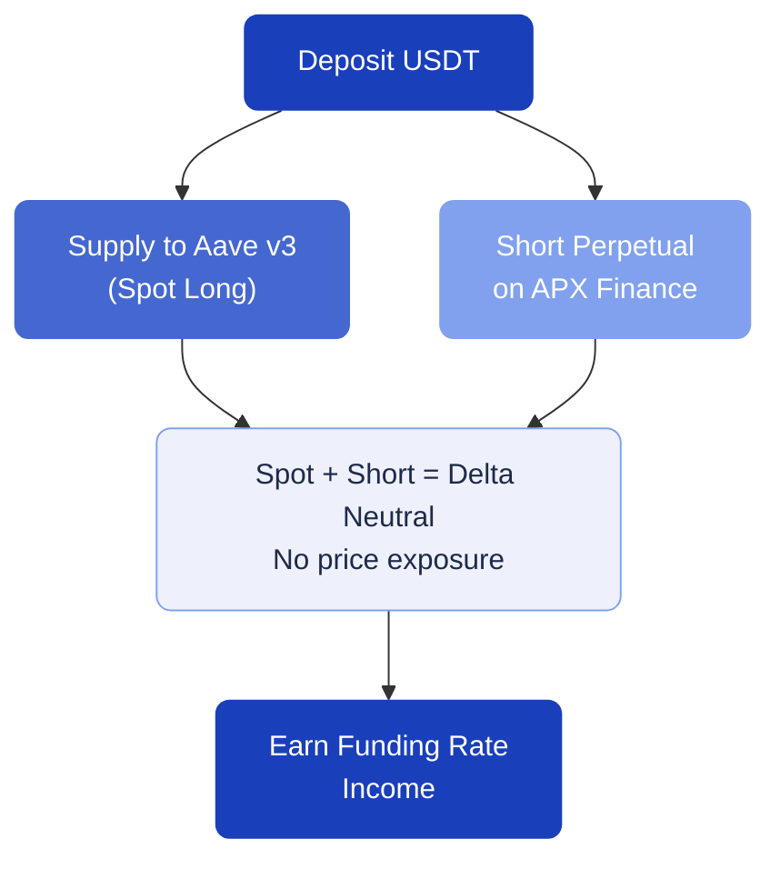

# Delta Neutral Funding Rate

The Delta Neutral strategy aims to earn funding rate income while hedging against price movements. It combines a lending position on Aave v3 with a short perpetual position on APX Finance.

---

## How it works

1. **Deposit** USDT as your base capital
2. **Supply** a portion to Aave v3 to earn lending interest
3. **Open a short perpetual position** on APX Finance using the same asset
4. The **spot exposure** (from Aave lending) and the **short exposure** (from the perpetual) cancel each other out, making your position "delta neutral" — meaning you are not exposed to price movements
5. **Earn funding rates** — when the market is bullish, shorts often receive funding payments from longs

---

## Setup steps

### Step 1: Choose your deposit token

Currently, USDT is the supported deposit token.

**Minimum deposit:** $250

### Step 2: Choose your token index

Select which asset to use for the cash-and-carry position:

| Token index | Description |
| --- | --- |
| BTC | Hedge BTC spot vs. BTC short |
| BNB | Hedge BNB spot vs. BNB short |

---

## When does this strategy work best?

- **Bullish markets** — funding rates tend to be positive (shorts get paid)
- **High open interest** — more trading activity means higher funding rates

!!!warning
Funding rates can turn negative during bearish periods, meaning you would pay instead of earn. The strategy monitors funding rate conditions and acts accordingly, but sustained negative rates will reduce returns.
!!!

---

## Key differences from other strategies

| | Leveraged Yield | Wick and Wait | Delta Neutral |
| --- | --- | --- | --- |
| **Price exposure** | Yes (leveraged) | Yes (concentrated LP) | No (hedged) |
| **Income source** | LP fees + farming | LP fees + farming | Funding rates |
| **Risk level** | Medium to High | Medium | Low to Medium |
| **Min. deposit** | $100 | $100 | $250 |
