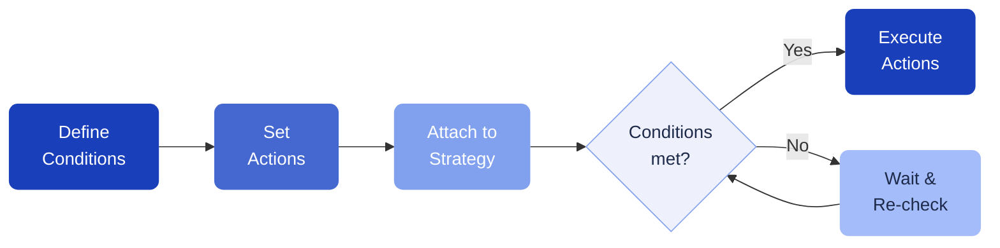

# Rules

Rules let you set up recurring automated actions, such as periodic token purchases. Think of them as a "set and forget" automation layer on top of your strategies.

---

## How rules work

A rule consists of:

- **Actions** — what to do (e.g., swap tokens, supply to a lending market)
- **Conditions** — when to trigger (e.g., every 24 hours, when a token balance exceeds a threshold)
- **Strategies** — which strategy the rule is attached to

Once a rule is active, the automation server checks the conditions regularly and executes the actions when all conditions are met.

---

## Managing rules

Go to **Strategies > Rules** in the sidebar to see all your rules.

- **Create** a new rule by defining actions and conditions
- **Attach** a rule to a strategy to link them together
- **Detach** a rule to stop it without deleting it

---

## Fees

A **$0.50 attach fee** is charged each time you activate a rule.

[!ref Fee details](/fees/overview/)
