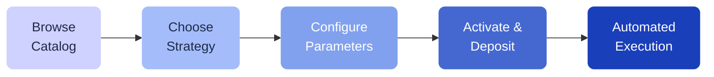

# Strategy Catalog

The Strategy Catalog is where you find ready-to-use strategies created by the Pecunity team. Each strategy has been tested and optimized for specific market conditions.

---

## How to use a strategy from the catalog

1. Go to **Strategies > Catalog** in the sidebar
2. Browse the available strategies and choose one that fits your goals
3. Click on a strategy to see its details, including performance history and configuration
4. Select your **base token** and **amount** to deposit
5. Choose additional parameters (risk level, market condition, etc.)
6. Confirm and activate the strategy

Your funds are deposited into a dedicated **strategy vault**. The automation server monitors conditions and executes the strategy actions on your behalf.

---

## Strategy details

Each catalog strategy shows you:

- **Value history** — how the strategy has performed over time (filterable by time range)
- **Active strategies count** — how many users are currently running this strategy
- **Configuration steps** — what you need to set up before activating

---

## Managing your strategies

Once a strategy is active, you can view it under **Strategies > Your Strategies**. For each active strategy you can see:

- **Current value** and profit/loss
- **Event history** — every action the strategy has taken
- **Reward history** — collected fees and rewards
- **Performance metrics** — APY, total return, etc.

### Depositing more

You can add more funds to an active strategy at any time using the **Deposit** function.

### Withdrawing

Use the **Withdraw** function to pull your funds out of a strategy vault back to your main wallet.

### Stopping a strategy

If you want to stop a strategy, use **Detach**. This deactivates the automation while your funds remain in the vault until you withdraw them.

---

## Fees

A one-time **$1.00 attach fee** is charged when you activate a strategy. Ongoing strategy execution fees depend on the actions performed.

[!ref Fee details](/fees/overview/)
