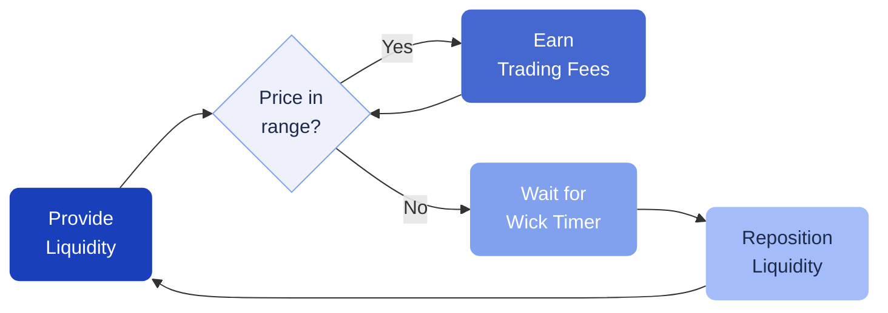

# Wick and Wait Yield Farming

The Wick and Wait strategy provides concentrated liquidity on PancakeSwap v3 and waits for price wicks to generate trading fee income. It is designed for markets that move sideways or trend upward.

---

## How it works

1. **Provide concentrated liquidity** on PancakeSwap v3 with a tight price range
2. **Earn trading fees** when the price trades within your range
3. **Wait for wicks** — when a sudden price movement pushes the price out of range, the strategy waits for a defined period before repositioning
4. **Reposition** — once the wait time passes, the strategy removes liquidity, swaps back, and re-enters at the current price
5. **Collect rewards** — MasterChef farming rewards are harvested automatically

---

## Setup steps

### Step 1: Choose your base token

Currently, USDT is the supported base token.

**Minimum deposit:** $100

### Step 2: Choose your quote token

Select the token to pair with USDT in the liquidity pool:

| Quote token | Network |
| --- | --- |
| BTC | BNB Smart Chain |
| BNB | BNB Smart Chain |
| ETH | BNB Smart Chain |

### Step 3: Choose your market parameters

| Parameter | Liquidity range | Wick wait time |
| --- | --- | --- |
| **Bear Market** | ±4% | 6 hours |
| **Sideways Market** | ±7% | 60 hours |
| **Balanced** | ±9% | 22 hours |
| **Bull Market** | ±8% | 30 hours |
| **Wait And Relax** | ±15% | 75 hours |

A tighter range means higher fee income when the price stays within range, but more frequent repositioning when it doesn't. A wider range is more conservative but earns lower fees.

---

## When does this strategy work best?

- **Sideways markets** — the price stays within range, maximizing fee income
- **Uptrending markets** — moderate repositioning with good fee capture
- **Not ideal for strong downtrends** — frequent repositioning can erode returns

!!!
Each parameter set performs differently depending on market conditions. There is no "best" option — choose based on your market outlook.
!!!
